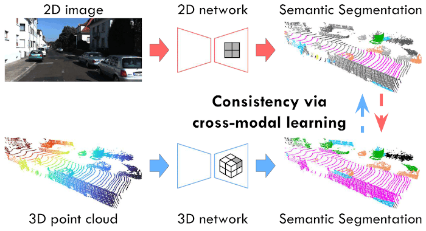

# Cross-modal Learning for Domain Adaptation in 3D Semantic Segmentation

Official code for the journal paper which builds on the [code](https://github.com/valeoai/xmuda) from the conference paper. The principal additions of this repo are:

- Cross-modal semi-supervised domain adaptation (xMoSSDA)
- New datasets: nuScenes-Lidarseg (instead of nuScenes), VirtualKitti

## Paper


[Cross-modal Learning for Domain Adaptation in 3D Semantic Segmentation](https://arxiv.org/abs/2101.07253)  
 [Maximilian Jaritz](https://team.inria.fr/rits/membres/maximilian-jaritz/), [Tuan-Hung Vu](https://tuanhungvu.github.io/), [Raoul de Charette](https://team.inria.fr/rits/membres/raoul-de-charette/),  Émilie Wirbel, [Patrick Pérez](https://ptrckprz.github.io/)  

If you find this code useful for your research, please cite our papers:

```
@inproceedings{jaritz2019xmuda,
	title={{xMUDA}: Cross-Modal Unsupervised Domain Adaptation for {3D} Semantic Segmentation},
	author={Jaritz, Maximilian and Vu, Tuan-Hung and de Charette, Raoul and Wirbel, Emilie and P{\'e}rez, Patrick},
	booktitle={CVPR},
	year={2020}
}
@inproceedings{jaritz2022cross,
	title={Cross-modal Learning for Domain Adaptation in {3D} Semantic Segmentation},
	author={Jaritz, Maximilian and Vu, Tuan-Hung and de Charette, Raoul and Wirbel, Emilie and P{\'e}rez, Patrick},
	booktitle={TPAMI},
	year={2022}
}
```

## Preparation
### Prerequisites
Tested with
* PyTorch 1.4
* CUDA 10.0
* Python 3.8
* [SparseConvNet](https://github.com/facebookresearch/SparseConvNet)
* [nuscenes-devkit](https://github.com/nutonomy/nuscenes-devkit)

### Installation
As 3D network we use SparseConvNet. It requires to use CUDA 10.0 (it did not work with 10.1 when we tried).
We advise to create a new conda environment for installation. PyTorch and CUDA can be installed, and SparseConvNet
installed/compiled as follows:
```
$ conda install pytorch=1.4 torchvision cudatoolkit=10.0 -c pytorch
$ pip install --upgrade git+https://github.com/facebookresearch/SparseConvNet.git
```

Clone this repository and install it with pip. It will automatically install the nuscenes-devkit as a dependency.
```
$ git clone https://github.com/valeoai/xmuda.git
$ cd xmuda
$ pip install -ve .
```
The `-e` option means that you can edit the code on the fly.

### Datasets
#### nuScenes-Lidarseg
Please download from the [NuScenes website](https://www.nuscenes.org/nuscenes#download) and extract:
- Full dataset
- nuScenes-lidarseg (All)

You need to perform preprocessing to generate the data for xMUDA first.
The preprocessing subsamples the 360° LiDAR point cloud to only keep the points that project into
the front camera image. All information will be stored in a pickle file (except the images which will be 
read on-the-fly by the dataloader during training).

Please edit the script `xmuda/data/nuscenes_lidarseg/preprocess.py` as follows and then run it.
* `root_dir` should point to the root directory of the NuScenes dataset
* `out_dir` should point to the desired output directory to store the pickle files

#### A2D2
Please download the Semantic Segmentation dataset and Sensor Configuration from the
[Audi website](https://www.a2d2.audi/a2d2/en/download.html) or directly use `wget` and
the following links, then extract.
```
$ wget https://aev-autonomous-driving-dataset.s3.eu-central-1.amazonaws.com/camera_lidar_semantic.tar
$ wget https://aev-autonomous-driving-dataset.s3.eu-central-1.amazonaws.com/cams_lidars.json
```

The dataset directory should have this basic structure:
```
a2d2                                   % A2D2 dataset root
 ├── 20180807_145028
 ├── 20180810_142822
 ├── ...
 ├── cams_lidars.json
 └── class_list.json
```
For preprocessing, we undistort the images and store them separately as .png files.
Similar to NuScenes preprocessing, we save all points that project into the front camera image as well
as the segmentation labels to a pickle file.

Please edit the script `xmuda/data/a2d2/preprocess.py` as follows and then run it.
* `root_dir` should point to the root directory of the A2D2 dataset
* `out_dir` should point to the desired output directory to store the undistorted images and pickle files.
It should be set differently than the `root_dir` to prevent overwriting of images.

#### SemanticKITTI
Please download the files from the [SemanticKITTI website](http://semantic-kitti.org/dataset.html) and
additionally the [color data](http://www.cvlibs.net/download.php?file=data_odometry_color.zip)
from the [Kitti Odometry website](http://www.cvlibs.net/datasets/kitti/eval_odometry.php). Extract
everything into the same folder.

Similar to NuScenes preprocessing, we save all points that project into the front camera image as well
as the segmentation labels to a pickle file.

Please edit the script `xmuda/data/semantic_kitti/preprocess.py` as follows and then run it.
* `root_dir` should point to the root directory of the SemanticKITTI dataset
* `out_dir` should point to the desired output directory to store the pickle files


#### VirtualKITTI

Clone the following repo:
```
$ git clone https://github.com/VisualComputingInstitute/vkitti3D-dataset.git
```
Download raw data and extract with following script:
```
$ cd vkitti3D-dataset/tools
$ mkdir path/to/virtual_kitti
$ bash download_raw_vkitti.sh path/to/virtual_kitti
```
Generate point clouds (npy files):
```
$ cd vkitti3D-dataset/tools
$ for i in 0001 0002 0006 0018 0020; do python create_npy.py --root_path path/to/virtual_kitti --out_path path/to/virtual_kitti/vkitti_npy --sequence $i; done
```

Similar to NuScenes preprocessing, we save all points and segmentation labels to a pickle file.

Please edit the script `xmuda/data/virtual_kitti/preprocess.py` as follows and then run it.
* `root_dir` should point to the root directory of the VirtualKITTI dataset
* `out_dir` should point to the desired output directory to store the pickle files


## UDA Experiments

### xMUDA
You can run the training with
```
$ cd <root dir of this repo>
$ python xmuda/train_xmuda.py --cfg=configs/nuscenes_lidarseg/usa_singapore/uda/xmuda.yaml
```

The output will be written to `/home/<user>/workspace/outputs/xmuda_journal/<config_path>` by 
default. The `OUTPUT_DIR` can be modified in the config file in
(e.g. `configs/nuscenes/usa_singapore/xmuda.yaml`) or optionally at run time in the
command line (dominates over config file). Note that `@` in the following example will be
automatically replaced with the config path, i.e. with `nuscenes_lidarseg/usa_singapore/uda/xmuda`.
```
$ python xmuda/train_xmuda.py --cfg=configs/nuscenes_lidarseg/usa_singapore/uda/xmuda.yaml OUTPUT_DIR path/to/output/directory/@
```

You can start the trainings on the other UDA scenarios (Day/Night and A2D2/SemanticKITTI) analogously:
```
$ python xmuda/train_xmuda.py --cfg=configs/nuscenes_lidarseg/day_night/uda/xmuda.yaml
$ python xmuda/train_xmuda.py --cfg=configs/a2d2_semantic_kitti/uda/xmuda.yaml
$ python xmuda/train_xmuda.py --cfg=configs/virtual_kitti_semantic_kitti/uda/xmuda.yaml
```

### xMUDA<sub>PL</sub>
After having trained the xMUDA model, generate the pseudo-labels as follows:
```
$ python xmuda/test.py --cfg=configs/nuscenes_lidarseg/usa_singapore/uda/xmuda.yaml --pselab @/model_2d_100000.pth @/model_3d_100000.pth DATASET_TARGET.TEST "('train_singapore',)"
```
Note that we use the last model at 100,000 steps to exclude supervision from the validation set by picking the best
weights. The pseudo labels and maximum probabilities are saved as `.npy` file.

Please edit the `pselab_paths` in the config file, e.g. `configs/nuscenes_lidarseg/usa_singapore/uda/xmuda.yaml`,
to match your path of the generated pseudo-labels.

Then start the training. The pseudo-label refinement (discard less confident pseudo-labels) is done
when the dataloader is initialized.
```
$ python xmuda/train_xmuda.py --cfg=configs/nuscenes_lidarseg/usa_singapore/uda/xmuda_pl.yaml
```

You can start the trainings on the other UDA scenarios (Day/Night, A2D2/SemanticKITTI, VirtualKITTI/SemanticKITTI) analogously:
```
$ python xmuda/test.py --cfg=configs/nuscenes_lidarseg/day_night/uda/xmuda.yaml --pselab @/model_2d_100000.pth @/model_3d_100000.pth DATASET_TARGET.TEST "('train_night',)"
$ python xmuda/train_xmuda.py --cfg=configs/nuscenes_lidarseg/day_night/uda/xmuda_pl.yaml

# use batch size 1, because of different image sizes in SemanticKITTI
$ python xmuda/test.py --cfg=configs/a2d2_semantic_kitti/uda/xmuda.yaml --pselab @/model_2d_100000.pth @/model_3d_100000.pth DATASET_TARGET.TEST "('train',)" VAL.BATCH_SIZE 1
$ python xmuda/train_xmuda.py --cfg=configs/a2d2_semantic_kitti/uda/xmuda_pl.yaml

# use batch size 1, because of different image sizes in SemanticKITTI
$ python xmuda/test.py --cfg=configs/virtual_kitti_semantic_kitti/uda/xmuda.yaml --pselab @/model_2d_030000.pth @/model_3d_030000.pth DATASET_TARGET.TEST "('train',)" VAL.BATCH_SIZE 1
$ python xmuda/train_xmuda.py --cfg=configs/nuscenes_lidarseg/day_night/uda/xmuda_pl.yaml
```

### Baseline
Train the baselines (only on source) with:
```
$ python xmuda/train_baseline.py --cfg=configs/nuscenes_lidarseg/usa_singapore/uda/baseline.yaml
$ python xmuda/train_baseline.py --cfg=configs/nuscenes_lidarseg/day_night/uda/baseline.yaml
$ python xmuda/train_baseline.py --cfg=configs/a2d2_semantic_kitti/uda/baseline.yaml
$ python xmuda/train_baseline.py --cfg=configs/virtual_kitti_semantic_kitti/uda/baseline.yaml
```

## SSDA Experiments
We provide the experiments for the following SSDA scenarios:
- nuSc-Lidarseg USA/Singapore (Table 3 in paper)
- A2D2/Sem.KITTI (Table 3 in paper)
- Virt.KITTI/Sem.KITTI (Table 11 in paper)

### xMSSDA
```
$ python xmuda/train_xmssda.py --cfg=configs/nuscenes_lidarseg/usa_singapore/ssda/xmssda.yaml
$ python xmuda/train_xmssda.py --cfg=configs/a2d2_semantic_kitti/ssda/xmssda.yaml
$ python xmuda/train_xmssda.py --cfg=configs/virtual_kitti_semantic_kitti/ssda/xmssda.yaml
```

### xMSSDA<sub>PL</sub>
```
$ python xmuda/test.py --cfg=configs/nuscenes_lidarseg/usa_singapore/ssda/xmssda.yaml --pselab @/model_2d_100000.pth @/model_3d_100000.pth DATASET_TARGET.TEST "('train_singapore_unlabeled',)"
$ python xmuda/train_xmssda.py --cfg=configs/nuscenes_lidarseg/usa_singapore/ssda/xmssda_pl.yaml
$ python xmuda/test.py --cfg=configs/a2d2_semantic_kitti/ssda/xmssda.yaml --pselab @/model_2d_100000.pth @/model_3d_100000.pth DATASET_TARGET.TEST "('train_unlabeled',)" VAL.BATCH_SIZE 1
$ python xmuda/train_xmssda.py --cfg=configs/a2d2_semantic_kitti/ssda/xmssda_pl.yaml
$ python xmuda/test.py --cfg=configs/virtual_kitti_semantic_kitti/ssda/xmssda.yaml --pselab @/model_2d_030000.pth @/model_3d_030000.pth DATASET_TARGET.TEST "('train_unlabeled',)" VAL.BATCH_SIZE 1
$ python xmuda/train_xmssda.py --cfg=configs/virtual_kitti_semantic_kitti/ssda/xmssda_pl.yaml
```

### Baseline

Non-UDA baseline, training on labeled target dataset only.
```
$ python xmuda/train_baseline.py --cfg=configs/nuscenes_lidarseg/usa_singapore/ssda/ssda_baseline_trg.yaml
$ python xmuda/train_baseline.py --cfg=configs/a2d2_semantic_kitti/ssda/ssda_baseline_trg.yaml
$ python xmuda/train_baseline.py --cfg=configs/virtual_kitti_semantic_kitti/ssda/ssda_baseline_trg.yaml
```

Non-UDA baseline, training on (labeled) source and labeled target.
```
$ python xmuda/train_baseline_src_trg.py --cfg=configs/nuscenes_lidarseg/usa_singapore/ssda/ssda_baseline_src_trg.yaml
$ python xmuda/train_baseline_src_trg.py --cfg=configs/a2d2_semantic_kitti/ssda/ssda_baseline_src_trg.yaml
$ python xmuda/train_baseline_src_trg.py --cfg=configs/virtual_kitti_semantic_kitti/ssda/ssda_baseline_src_trg.yaml
```

## Testing
You can provide which checkpoints you want to use for testing. We used the ones
that performed best on the validation set during training (the best val iteration for 2D and 3D is
shown at the end of each training). Note that `@` will be replaced
by the output directory for that config file. For example:
```
$ cd <root dir of this repo>
$ python xmuda/test.py --cfg=configs/nuscenes_lidarseg/usa_singapore/uda/xmuda.yaml @/model_2d_065000.pth @/model_3d_095000.pth
```

## License
xMUDA is released under the [Apache 2.0 license](./LICENSE).